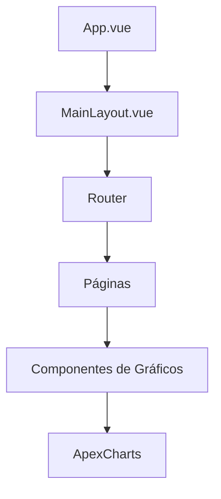
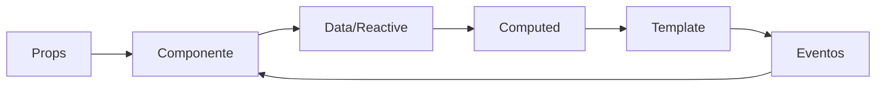

# 🏗️ Arquitetura do Projeto

Este documento descreve a arquitetura, estrutura e padrões utilizados no projeto **Quasar ApexCharts V2**.

## 📋 Índice

- [Visão Geral](#-visão-geral)
- [Estrutura de Diretórios](#-estrutura-de-diretórios)
- [Padrões Arquiteturais](#-padrões-arquiteturais)
- [Fluxo de Dados](#-fluxo-de-dados)
- [Componentes](#-componentes)
- [Roteamento](#-roteamento)
- [Internacionalização](#-internacionalização)
- [Configurações](#-configurações)

## 🎯 Visão Geral

O projeto utiliza uma arquitetura baseada em **Vue 3** com **Composition API**, **Quasar Framework** para UI e **ApexCharts** para visualizações. A estrutura segue padrões de **Single Page Application (SPA)** com organização modular e reutilizável.

### Princípios Arquiteturais

- **Modularidade**: Componentes organizados por funcionalidade
- **Reutilização**: Componentes genéricos e específicos bem definidos
- **Separação de Responsabilidades**: Cada módulo tem uma responsabilidade clara
- **Performance**: Carregamento assíncrono e otimizações
- **Manutenibilidade**: Código limpo e bem documentado

## 📁 Estrutura de Diretórios

```
quasar-apexcharts/
├── public/                     # Arquivos estáticos
│   ├── favicon.ico
│   └── icons/                  # Ícones da aplicação
├── src/                        # Código fonte principal
│   ├── assets/                 # Recursos estáticos
│   ├── boot/                   # Configurações de inicialização
│   │   ├── apexcharts.js       # Configuração do ApexCharts
│   │   ├── axios.js            # Configuração do Axios
│   │   └── i18n.js             # Configuração de i18n
│   ├── components/             # Componentes reutilizáveis
│   │   ├── charts/             # Componentes de gráficos
│   │   │   ├── area/           # Gráficos de área
│   │   │   ├── bar/            # Gráficos de barras
│   │   │   ├── bubble/         # Gráficos de bolhas
│   │   │   ├── candlestick/    # Gráficos de velas
│   │   │   ├── column/         # Gráficos de colunas
│   │   │   ├── donut/          # Gráficos de rosca
│   │   │   ├── heatmap/        # Mapas de calor
│   │   │   ├── line/           # Gráficos de linha
│   │   │   ├── pie/            # Gráficos de pizza
│   │   │   ├── polarArea/      # Gráficos de área polar
│   │   │   ├── radialBar/      # Gráficos de barras radiais
│   │   │   └── scatterPlot/    # Gráficos de dispersão
│   │   ├── Card.vue            # Componente de card
│   │   ├── CardSkeleton.vue    # Skeleton loading
│   │   ├── ExternalLink.vue    # Links externos
│   │   ├── LangSwitch.vue      # Seletor de idioma
│   │   ├── Navbar.vue          # Navegação principal
│   │   └── RouterLink.vue      # Links de roteamento
│   ├── composables/            # Composables Vue 3
│   │   └── UseDriveJs.js       # Composable para Driver.js
│   ├── css/                    # Estilos globais
│   │   └── app.css
│   ├── i18n/                   # Internacionalização
│   │   ├── en-US/              # Traduções em inglês
│   │   ├── pt-BR/              # Traduções em português
│   │   └── index.js            # Configuração principal
│   ├── layouts/                # Layouts da aplicação
│   │   └── MainLayout.vue      # Layout principal
│   ├── pages/                  # Páginas da aplicação
│   │   ├── chartTypes/         # Páginas por tipo de gráfico
│   │   │   ├── AllCharts.vue   # Todos os gráficos
│   │   │   ├── AreaCharts.vue  # Gráficos de área
│   │   │   ├── BarCharts.vue   # Gráficos de barras
│   │   │   └── ...             # Outras páginas
│   │   ├── Error404.vue        # Página de erro 404
│   │   └── Index.vue           # Página inicial
│   ├── router/                 # Configuração de rotas
│   │   ├── index.js            # Configuração principal
│   │   └── routes.js           # Definição de rotas
│   ├── App.vue                 # Componente raiz
│   ├── index.template.html     # Template HTML
│   └── quasar.d.ts             # Definições TypeScript
├── docs/                       # Documentação do projeto
├── babel.config.js             # Configuração do Babel
├── jsconfig.json               # Configuração do JavaScript
├── package.json                # Dependências e scripts
├── quasar.conf.js              # Configuração do Quasar
├── README.md                   # Documentação principal
└── yarn.lock                   # Lock file do Yarn
```

## 🏛️ Padrões Arquiteturais

### 1. Component-Based Architecture

O projeto segue o padrão de **Component-Based Architecture** do Vue, onde:

- **Componentes Atômicos**: Componentes pequenos e específicos
- **Componentes Moleculares**: Combinação de componentes atômicos
- **Componentes Organismos**: Componentes complexos que formam seções
- **Templates**: Páginas que combinam organismos

### 2. Lazy Loading

Implementação de carregamento assíncrono para otimizar performance:

```javascript
// Exemplo de lazy loading
const ApexArea = defineAsyncComponent(() =>
  import('src/components/charts/area/ApexArea.vue')
)
```

### 3. Composition API

Uso do **Composition API** do Vue 3 para melhor organização do código:

```javascript
// Exemplo de composable
export default function useDriver() {
  const initDriver = () => {
    // Lógica do Driver.js
  }

  return {
    initDriver
  }
}
```

## 🔄 Fluxo de Dados

### 1. Inicialização da Aplicação



### 2. Fluxo de Dados nos Componentes



## 🧩 Componentes

### Estrutura de um Componente de Gráfico

```vue
<template>
  <apexchart
    height="300"
    type="area"
    :options="options"
    :series="series"
  />
</template>

<script>
import { defineComponent } from 'vue'
import { getCssVar } from 'quasar'

export default defineComponent({
  name: 'ApexArea',
  data() {
    return {
      options: {
        // Configurações do gráfico
        colors: [getCssVar('primary'), getCssVar('secondary')],
        // ... outras opções
      },
      series: [
        // Dados do gráfico
      ]
    }
  }
})
</script>
```

### Padrões de Nomenclatura

- **Componentes**: PascalCase (`ApexArea.vue`)
- **Arquivos**: kebab-case (`apex-area.vue`)
- **Props**: camelCase (`chartData`)
- **Events**: kebab-case (`@data-updated`)

## 🛣️ Roteamento

### Estrutura de Rotas

```javascript
const routes = [
  {
    path: '/',
    component: () => import('layouts/MainLayout.vue'),
    children: [
      {
        path: '',
        name: 'home',
        component: () => import('pages/Index.vue')
      },
      {
        path: '/all-charts',
        name: 'allCharts',
        component: () => import('pages/chartTypes/AllCharts.vue')
      }
      // ... outras rotas
    ]
  }
]
```

### Lazy Loading de Rotas

Todas as rotas utilizam **lazy loading** para otimizar o carregamento inicial da aplicação.

## 🌐 Internacionalização

### Estrutura de i18n

```
i18n/
├── index.js              # Configuração principal
├── en-US/
│   └── index.js          # Traduções em inglês
└── pt-BR/
    └── index.js          # Traduções em português
```

### Uso nas Páginas

```vue
<template>
  <h1>{{ $t('presentation.title') }}</h1>
</template>
```

## ⚙️ Configurações

### Boot Files

Os **boot files** são executados na inicialização da aplicação:

- `apexcharts.js`: Configuração do ApexCharts
- `axios.js`: Configuração do Axios
- `i18n.js`: Configuração de internacionalização

### Quasar Configuration

O arquivo `quasar.conf.js` contém:

- **Build settings**: Configurações de build
- **Framework settings**: Configurações do Quasar
- **Dev server**: Configurações do servidor de desenvolvimento
- **PWA settings**: Configurações de PWA
- **Electron settings**: Configurações para desktop

## 🎨 Tema e Estilos

### Integração com Quasar

Os gráficos utilizam as cores do tema do Quasar:

```javascript
colors: [
  getCssVar('primary'),
  getCssVar('secondary'),
  getCssVar('negative')
]
```

### CSS Custom Properties

Uso de variáveis CSS do Quasar para manter consistência visual.

## 📱 Responsividade

### Breakpoints do Quasar

- `xs`: < 600px
- `sm`: 600px - 1023px
- `md`: 1024px - 1439px
- `lg`: 1440px - 1919px
- `xl`: > 1920px

### Grid System

```vue
<div class="col-md-6 col-xs-12">
  <q-card>
    <apex-area />
  </q-card>
</div>
```

## 🚀 Performance

### Otimizações Implementadas

1. **Lazy Loading**: Componentes e rotas carregados sob demanda
2. **Tree Shaking**: Apenas código necessário incluído no bundle
3. **Code Splitting**: Divisão do código em chunks menores
4. **Caching**: Configurações de cache para assets estáticos

### Bundle Analysis

Para analisar o tamanho do bundle:

```bash
quasar build --analyze
```

## 🔧 Desenvolvimento

### Hot Reload

O servidor de desenvolvimento suporta **Hot Module Replacement (HMR)** para atualizações em tempo real.

### Linting

Configuração do ESLint para manter qualidade do código:

```bash
yarn run lint
```

## 📊 Monitoramento

### Métricas de Performance

- **First Contentful Paint (FCP)**
- **Largest Contentful Paint (LCP)**
- **Cumulative Layout Shift (CLS)**

### Debugging

- **Vue DevTools**: Para debugging de componentes
- **Quasar DevTools**: Para debugging do Quasar
- **Browser DevTools**: Para debugging de performance

---

Esta arquitetura foi projetada para ser **escalável**, **manutenível** e **performática**, seguindo as melhores práticas do ecossistema Vue/Quasar.
